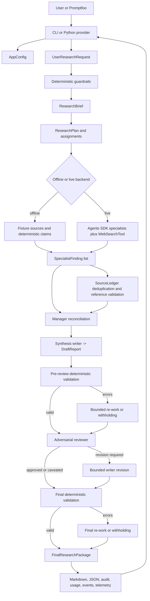

# Python Code Architecture: Housing Policy Research Network

This document explains how the Python implementation is assembled, how data moves through the application, what each Python module requires and returns, and where the OpenAI Agents SDK and Promptfoo participate. It is intended for engineers who need to understand, operate, test, extend, or review the system.

## 1. Executive summary

The application is a CLI-first, application-controlled research pipeline. Python owns the workflow state and release policy. Agent calls are bounded workers inside that workflow.

The principal design choices are:

- `ResearchWorkflow` is the control plane. It owns routing, concurrency, retries, validation, re-work, review, revision limits, telemetry, metrics, and artifact persistence.
- Pydantic models are the data plane. Every important boundary has a typed input or output contract.
- The OpenAI Agents SDK supplies model-backed agents, typed output parsing, `Runner.run`, web search, trace configuration, and lifecycle hooks.
- The source ledger is the citation authority. Claims and report paragraphs cite internal source IDs, not URLs.
- Deterministic validators run before review and after revision. Invalid report units are repaired or visibly withheld.
- Offline execution uses a synthetic fixture and deterministic branch outputs. Live execution uses SDK agents and hosted web search.
- Promptfoo is external to normal report generation. It repeatedly invokes Python providers to compare architectures and ablations.
- Every run writes a replayable artifact directory containing the brief, plan, sources, draft, review, final report, audit, usage, events, and per-interaction telemetry.

## 2. Build and runtime stack

| Layer | Technology | Responsibility |
|---|---|---|
| Language | Python 3.12+ | Application logic, orchestration, validation, telemetry, and persistence |
| Packaging | `setuptools`, `pyproject.toml`, `src/` layout | Editable installation and the `housing-research` console entry point |
| CLI | Typer and Rich | Commands, clarification prompts, progress events, and usage summaries |
| Agent runtime | OpenAI Agents SDK | Agent definitions, typed output, model execution, web search, tracing metadata, lifecycle hooks |
| Contracts | Pydantic v2 | Strict runtime models and model-output normalization |
| Configuration | `pydantic-settings` | Environment variables, `.env`, defaults, and bounds |
| Concurrency | `asyncio` | Parallel specialist branches and manager reconciliation |
| Resilience | Application fallbacks, bounded retries, `asyncio.wait_for` | Failure containment and time-bounded revision or re-work |
| Testing | pytest | Unit, integration, and golden artifact tests |
| Evaluation | Promptfoo plus Python providers/assertions | Regression comparison, baseline comparison, security cases, and ablations |

The package is installed with:

```powershell
python -m pip install -e ".[dev]"
```

The console script declared in `pyproject.toml` is:

```text
housing-research = housing_policy_agents.cli:app
```

The equivalent module invocation is:

```powershell
python -m housing_policy_agents.cli
```

## 3. System map



### 3.1 Control flow versus data flow

The control flow is ordinary Python. `ResearchWorkflow.run()` explicitly calls each stage and decides what happens next.

The data flow is typed:

```text
UserResearchRequest
  -> ResearchBrief
  -> ResearchPlan / ResearchAssignment
  -> SpecialistFinding / SourceRecord / EvidenceClaim
  -> ManagerSynthesis
  -> DraftReport
  -> ValidationReport and AdversarialReview
  -> ReportAudit and UsageReport
  -> FinalResearchPackage
```

### 3.2 OpenAI Agents SDK integration points

| SDK capability | Python location | How it is used |
|---|---|---|
| `Agent` | `agents/factory.py` | Defines orchestrator, specialist, manager, writer, reviewer, and re-work agents |
| `AgentOutputSchema` | `agents/factory.py` | Requests strict JSON schemas where compatible and non-strict SDK schemas for typed mappings |
| `Agent.as_tool` | `agents/factory.py` | Builds an inspectable manager/specialist tool graph |
| `Runner.run` | `telemetry/interactions.py` | Executes every live model-backed stage |
| `RunConfig` | Specialist, manager, writer, reviewer, and re-work modules | Supplies model, workflow name, trace ID, sensitivity setting, and trace metadata |
| `WebSearchTool` | `tools/research.py` | Gives live specialist agents hosted web search |
| `RunHooksBase.on_llm_end` | `telemetry/interactions.py` | Captures raw responses and usage before typed-output parsing can fail |
| SDK tracing metadata | Each live stage | Correlates calls using run ID, branch, manager, stage, and trace ID |

The application does not use an SDK handoff to transfer ownership of the active run. Python retains control.

`build_agent_graph()` creates manager agents with specialist tools and an orchestrator agent with manager tools. `ResearchWorkflow.__init__()` stores that graph in `self.graph`, but the current `run()` method does not dispatch through `self.graph`, `manager_tools`, or the orchestrator agent. Production execution calls specialists, managers, the writer, reviewer, and re-work agent directly. This makes the runtime hierarchy application-mediated rather than an SDK-controlled nested handoff graph.

## 4. End-to-end execution lifecycle

### 4.1 CLI intake

The `ask` command receives a housing-policy question, `--fast`, `--provider`, and a compatibility `--format` option. It constructs `UserResearchRequest`, gathers clarification answers when required, and calls `ResearchWorkflow.run()` through `asyncio.run()`.

Raw Markdown and JSON are not printed to the terminal. The CLI prints progress, the run ID, artifact path, token counts, time, and estimated token cost.

### 4.2 Configuration

`AppConfig` reads constructor arguments, process environment variables, and `.env`. The CLI overrides the provider, network permission, and fixture path. Live mode is considered enabled only when all three conditions are true:

```text
research_provider == "web"
allow_network == true
OPENAI_API_KEY is non-empty
```

### 4.3 Deterministic guardrails

`assess_request()` rejects requests that are outside housing policy, seek targeted unlawful discrimination, or contain likely sensitive identifiers. Prompt-injection-like user text is recorded as a warning rather than silently executed.

Retrieved source text is checked separately by `inspect_untrusted_text()`. A flagged source can remain in the ledger for auditability, but it must not become substantive evidence.

### 4.4 Brief and plan

`build_brief()` fills missing audience, scope, time horizon, and stakeholder perspective using explicit answers or transparent defaults.

`build_plan()` selects branches using deterministic keywords, creates one `ResearchAssignment` per branch, and embeds:

- the complete policy question;
- manager and sibling context;
- role-specific scope and exclusions;
- preferred source types;
- decisions the research should support;
- required analytical questions;
- source-ID and typed-output rules;
- a bounded search query.

The complete question can contain up to 4,000 characters. Search text is compacted to at most 500 characters while the full question remains in the assignment.

### 4.5 Specialist research

`ResearchWorkflow._run_specialists()` runs selected assignments concurrently behind an `asyncio.Semaphore`. Each branch can retry up to `max_branch_retries`.

Offline mode:

1. `FixtureResearchBackend.search()` selects fixture sources for the branch.
2. `deterministic_claims()` creates fixture-backed claims and contradictions.
3. Source prompt-injection text is flagged and removed from claim support.
4. The branch returns a typed `SpecialistFinding`.

Live mode:

1. `LiveResearchBackend.search()` returns cached source records, if any.
2. `build_specialist_agent()` gives the branch a specialized persona, assignment, typed output, and `WebSearchTool`.
3. `run_agent_with_telemetry()` calls `Runner.run()`.
4. The typed result is normalized into a `SpecialistFinding`.
5. Newly discovered sources are cached by search-query hash.

An exception does not abort the whole run. The branch returns a `FAILED` `SpecialistFinding` with an error and limitation.

### 4.6 Source ledger and evidence validation

All discovered sources enter `SourceLedger`. The ledger:

- assigns content hashes;
- deduplicates by normalized URL or content hash;
- preserves aliases and provenance;
- merges safety flags and claim links;
- resolves duplicate IDs to canonical IDs.

The workflow then validates claim references and country comparisons. Missing source IDs are recorded in run validation failures.

### 4.7 Manager reconciliation

Findings are grouped into policy, industry, advocacy, and global portfolios. Manager tasks run concurrently.

If every branch for a manager lacks a completed finding with discovered sources, the manager returns a partial synthesis with no invented claims.

Offline managers concatenate and classify deterministic findings. Live managers receive the full typed findings plus downstream context and return `ManagerSynthesis` through the Agents SDK.

When manager reconciliation is disabled for an ablation, `_pass_through_manager()` packages branch findings without a model-backed reconciliation call.

### 4.8 Drafting and writer failure containment

The writer receives the brief, manager packages, allowed source IDs, downstream context, and explicit depth requirements.

If no source IDs exist, `no_evidence_report()` returns a structurally valid status report and withholds substantive conclusions.

In live mode, the writer gets one normal attempt. If typed output fails, it gets one compact retry with shorter length requirements and fewer turns. If both attempts fail, the application returns the safe no-evidence report and records the reason in telemetry and workflow events.

Model-supplied citation IDs are not silently deleted from report paragraphs. `_contain_report_citations()` records the discrepancy and lets deterministic validation route the affected unit to re-work and audit.

### 4.9 Deterministic validation and re-work

`validate_report()` checks:

- at least one section;
- unique section IDs;
- a non-empty executive summary unless withheld;
- decision criteria and options unless withheld;
- citations on substantive paragraphs;
- citation IDs that exist in the source ledger;
- duplicate source URLs;
- decision-matrix citation validity;
- complete decision-matrix option scoring.

If validation fails, `rework_validation_failures()` first creates a withheld representation of every flagged target. The re-work agent is authorized to change only those target IDs.

Offline re-work removes invalid citations and withholds unsupported units deterministically. Live re-work receives the original report, withheld report, validation issues, source ledger, evidence package, and repair contract. It can run up to `max_rework_passes`, with a timeout per pass.

Unresolved units remain visibly withheld. Every issue produces a `ReportAuditEntry` showing original content, withheld content, final content, citations before and after, repair status, and attempt count.

### 4.10 Adversarial review and bounded revision

The reviewer checks grounding, source quality, legal calibration, causal claims, counterarguments, uncertainty, balance, and security.

Offline review is deterministic. Live review is an SDK agent returning `AdversarialReview`.

If the release recommendation is `revise`, or any finding requires revision, the writer receives the draft and review package. Revision is bounded by a turn limit and `revision_timeout_seconds`. If revision fails or times out, the validated draft is retained and the fallback is recorded.

### 4.11 Final validation, metrics, and persistence

The final report is validated again and may enter a second bounded re-work pass. The workflow then builds:

- `RunMetrics` from branch statuses, retries, validation failures, review scores, and elapsed time;
- `UsageReport` from interaction telemetry and the pricing catalog;
- `FinalResearchPackage` containing every major typed product.

`persist_package()` writes the artifact directory. `InteractionTelemetry.persist()` writes interaction and handoff records afterward.

## 5. Principal data contracts

All major contracts are defined in `src/housing_policy_agents/models/domain.py`. `StrictModel` forbids unknown fields and validates assignment changes.

| Contract | Produced by | Consumed by | Core requirements |
|---|---|---|---|
| `UserResearchRequest` | CLI or Promptfoo provider | Guardrails and brief builder | Question length 20 to 4,000 characters; valid mode, provider, and output formats |
| `ResearchBrief` | `build_brief()` | Planner, managers, writer | Question, audience, jurisdiction, scope, horizon, stakeholder perspective, defaults, disclosures |
| `SearchQuery` | Planner | Research backend and cache | Text length 5 to 500; branch, purpose, dates, domains, max results |
| `ResearchAssignment` | Planner | Specialist | Branch, manager, objective, context, scope, preferred sources, required questions, handoff rules |
| `ResearchPlan` | Planner | Workflow | Selected branches must have matching assignments |
| `SourceRecord` | Fixture or specialist | Source ledger | Stable internal ID, source metadata, type, tier, excerpt, provenance, safety flags |
| `EvidenceClaim` | Specialist | Manager and validators | Claim type, evidence strength, confidence, source IDs, limitations, originating agent |
| `SpecialistFinding` | Specialist | Source ledger and manager | Branch status, summary, claims, sources, contradictions, comparisons, limitations, error state |
| `ManagerSynthesis` | Manager | Writer and reviewer | Portfolio status, branch statuses, findings, reconciled claims, agreements, disagreements, limitations |
| `DecisionMatrix` | Writer | Validator and renderer | Every option must have every criterion; scores normalize to 1 through 5 or a typed range |
| `DraftReport` | Writer or re-work agent | Validator, reviewer, renderer | Summary, sections, decision matrix, evidence gaps, limitations, withholding and revision state |
| `AdversarialReview` | Reviewer | Revision decision and writer | Findings, five evaluation scores, release recommendation, reviewer notes |
| `ReportAudit` | Re-work | Artifact renderer | Issue-by-issue original, withheld, revised, citations, status, and attempts |
| `UsageReport` | Usage aggregator | CLI and artifact renderer | Per-interaction tokens, duration, estimate basis, aggregate wall and cumulative time |
| `RunMetrics` | Workflow | Final package and metrics artifact | Timing, model, trace ID, branch status, retries, validation failures, evaluation scores |
| `FinalResearchPackage` | Workflow | Persistence, CLI, Promptfoo | Complete immutable-style record of request through final report and telemetry summaries |

### 5.1 Source-ID invariant

The application uses short source IDs such as `s1` or `s_fhfa_chattel` inside claims and reports. Full URLs belong in `SourceRecord.url`.

If a live model returns a URL in `source_id`, `canonical_source_id()` hashes it into a stable ID and `SpecialistFinding` remaps nested references before strict validation. Ledger deduplication can then map multiple IDs to one canonical source.

### 5.2 Withholding invariant

A report unit that cannot pass bounded validation must not be released as ordinary substantive text. It is either repaired using accepted evidence or marked with a `[WITHHELD: ...]` representation and recorded in the audit report.

## 6. Production Python module reference

### 6.1 Package entry, configuration, and runtime context

#### `src/housing_policy_agents/__init__.py`

- **Purpose:** Declares package identity and version and re-exports `AppConfig`.
- **Inputs:** Python package import.
- **Outputs:** `AppConfig`, `__version__ = "0.1.0"`.
- **Side effects:** None.

#### `src/housing_policy_agents/config.py`

- **Purpose:** Defines the environment-backed execution policy.
- **Inputs:** Constructor arguments, process environment, and optional `.env` values.
- **Outputs:** Validated `AppConfig`; `live_enabled` property.
- **Requirements:** Web provider configuration must set `ALLOW_NETWORK=true`. Numeric settings are bounded with Pydantic fields.
- **Consumers:** CLI, workflow, agent factories, telemetry pricing, and Promptfoo provider.
- **Side effects:** Reads `.env` through `pydantic-settings`.

#### `src/housing_policy_agents/context.py`

- **Purpose:** Carries mutable run-scoped state across modules without using globals.
- **Inputs:** `AppConfig`, run ID, optional trace ID and telemetry recorder.
- **Outputs:** `RunContext` with metadata, retries, validation failures, tool-call count, and telemetry reference.
- **Consumers:** Every agent adapter and the workflow.
- **Side effects:** None by itself; contained objects accumulate state.

#### `src/housing_policy_agents/cli.py`

- **Purpose:** Implements the external command-line interface.
- **Inputs:** Typer arguments and options, environment-backed configuration, optional interactive clarification answers, saved package path for validation.
- **Outputs:** Progress text, run ID, artifact path, usage table, graph text, or validation JSON and exit code.
- **Commands:** `ask`, `demo`, `graph`, and `validate`.
- **Calls:** `decide_clarifications()`, `ResearchWorkflow.run()`, `mermaid_graph()`, and `validate_report()`.
- **Side effects:** Reads user input, prints terminal output, and indirectly writes artifacts through the workflow.
- **Requirement:** `--format` is currently a compatibility option and is ignored. Artifacts are always written to files.

### 6.2 Guardrails

#### `src/housing_policy_agents/guardrails/__init__.py`

- **Purpose:** Re-exports deterministic guardrail types and functions.
- **Inputs:** Package import.
- **Outputs:** `GuardrailDecision`, `assess_request`, and `inspect_untrusted_text`.
- **Side effects:** None.

#### `src/housing_policy_agents/guardrails/core.py`

- **Purpose:** Separates deterministic relevance, discrimination, sensitive-data, and injection checks from model judgment.
- **Inputs:** `UserResearchRequest` or untrusted source text.
- **Outputs:** `GuardrailDecision` or a list of prompt-injection flags.
- **Requirements:** A request must contain a recognized housing-policy term and must not match prohibited discrimination or PII patterns.
- **Consumers:** `ResearchWorkflow.run()` and offline specialist processing.
- **Failure behavior:** Disallowed user requests cause `WorkflowError`; source flags are retained as data.

### 6.3 Models

#### `src/housing_policy_agents/models/__init__.py`

- **Purpose:** Re-exports all domain models and enums.
- **Inputs:** Package import.
- **Outputs:** Symbols from `domain.py`.
- **Side effects:** None.

#### `src/housing_policy_agents/models/domain.py`

- **Purpose:** Defines every typed boundary, enum, normalization rule, and cross-field invariant.
- **Inputs:** Python dictionaries, JSON payloads, fixture values, and SDK model outputs.
- **Outputs:** Validated Pydantic objects or `ValidationError`.
- **Key behavior:** Forbids extra fields, normalizes dates and evidence labels, canonicalizes URL-shaped IDs, remaps nested references, validates decision matrices, and creates stable run-object IDs.
- **Consumers:** All production modules, eval providers, and tests.
- **Side effects:** None.

### 6.4 Agent definitions and adapters

#### `src/housing_policy_agents/agents/__init__.py`

- **Purpose:** Re-exports `build_agent_graph()`.
- **Inputs:** Package import.
- **Outputs:** Agent graph builder.
- **Side effects:** None.

#### `src/housing_policy_agents/agents/factory.py`

- **Purpose:** Creates versioned Agents SDK definitions and the inspectable agent graph.
- **Inputs:** `AppConfig`, branch or manager name, optional tools, and Markdown prompt files.
- **Outputs:** SDK `Agent` objects, output schemas, graph dictionary, and a Mermaid graph string.
- **Requirements:** Specialist outputs use strict schemas. Typed mapping models use the SDK non-strict schema fallback while retaining Pydantic validation.
- **Calls:** `Agent`, `AgentOutputSchema`, `Agent.as_tool`, and prompt-file reads.
- **Side effects:** Reads packaged prompt Markdown.
- **Runtime note:** The constructed nested tool graph is stored for inspection, but `ResearchWorkflow.run()` currently executes stages directly.

#### `src/housing_policy_agents/agents/orchestrator.py`

- **Purpose:** Implements deterministic clarification, briefing, branch selection, and plan generation.
- **Inputs:** `UserResearchRequest`, optional clarification answers, and the question text.
- **Outputs:** `ClarificationDecision`, `ResearchBrief`, selected `BranchName` values, search queries, and `ResearchPlan`.
- **Requirements:** Always starts with government, legal, and academic branches; adds operational, advocacy, sustainability, or global branches based on question terms.
- **Key data:** `BRANCH_PROFILES` defines role, scope, exclusions, preferred sources, and research dimensions for all eleven specialist branches.
- **Side effects:** None.

#### `src/housing_policy_agents/agents/specialists.py`

- **Purpose:** Executes one bounded specialist assignment and contains deterministic fixture findings.
- **Inputs:** `ResearchAssignment`, `ResearchBackend`, and `RunContext`.
- **Outputs:** `SpecialistFinding`, including a `FAILED` finding on exception.
- **Offline behavior:** Builds deterministic claims, tags source provenance, removes flagged source text from claim support, and creates global comparator records.
- **Live behavior:** Builds a branch-specific agent with web-search tools and calls `run_agent_with_telemetry()`.
- **Side effects:** SDK calls in live mode; telemetry records in both modes.

#### `src/housing_policy_agents/agents/managers.py`

- **Purpose:** Reconciles specialist findings by policy, industry, advocacy, or global portfolio.
- **Inputs:** `ManagerName`, list of `SpecialistFinding`, `RunContext`, and optional `ResearchBrief`.
- **Outputs:** `ManagerSynthesis`.
- **Requirements:** Only completed findings with discovered sources are substantively usable. No usable findings produce a partial, non-substantive manager fallback.
- **Offline behavior:** Deterministically aggregates claims, contradictions, agreements, and limitations.
- **Live behavior:** Sends typed findings and handoff context to a manager agent.

#### `src/housing_policy_agents/agents/writer.py`

- **Purpose:** Produces the draft report, decision matrix, safe fallback report, and bounded revision.
- **Inputs:** `ResearchBrief`, manager syntheses, allowed source IDs, `RunContext`, and later `AdversarialReview`.
- **Outputs:** `DraftReport`.
- **Offline behavior:** Produces a deterministic mortgage-portability report and deterministic revision.
- **Live behavior:** Calls the synthesis writer, retries once with a compact contract after failure, and runs a bounded revision after review.
- **Failure behavior:** Empty evidence or two failed writer attempts produce `no_evidence_report()`.
- **Citation behavior:** Records invalid model IDs for deterministic validation instead of silently making the report appear valid.

#### `src/housing_policy_agents/agents/reviewer.py`

- **Purpose:** Performs independent adversarial review.
- **Inputs:** `DraftReport`, `SourceLedger`, accepted evidence package, and `RunContext`.
- **Outputs:** `AdversarialReview` with findings, scores, and release recommendation.
- **Offline behavior:** Converts deterministic validation errors and weak-source use into review findings and reports source injection flags.
- **Live behavior:** Calls the reviewer agent through telemetry.
- **Fallback:** Empty ledgers use application-level deterministic review.

#### `src/housing_policy_agents/agents/rework.py`

- **Purpose:** Repairs only report units identified by deterministic validation and withholds unresolved units.
- **Inputs:** Report, `ValidationReport`, `SourceLedger`, accepted evidence, `RunContext`, and stage label.
- **Outputs:** `ReworkOutcome` containing revised report, audit entries, pass count, and final validation report.
- **Requirements:** Candidate changes are merged only for authorized target IDs. Re-work is bounded by passes and timeout.
- **Failure behavior:** An exception converts current flagged units to their withheld representation.
- **Side effects:** SDK call and telemetry in live mode; local telemetry in offline mode.

### 6.5 Workflow

#### `src/housing_policy_agents/workflows/__init__.py`

- **Purpose:** Re-exports `ResearchWorkflow`.
- **Inputs:** Package import.
- **Outputs:** Workflow class.
- **Side effects:** None.

#### `src/housing_policy_agents/workflows/research_workflow.py`

- **Purpose:** Implements the complete intake-to-artifact state machine.
- **Inputs:** `AppConfig`; `run()` receives `UserResearchRequest`, optional answers, and optional progress callback.
- **Outputs:** `FinalResearchPackage` or `WorkflowError` for a rejected request.
- **Owns:** Run and trace IDs, branch selection, backend selection, concurrency, retries, source ledger, manager grouping, writer retries, validators, re-work, review, revision timeout, metrics, usage, events, handoffs, and artifact persistence.
- **Concurrency:** Specialist assignments and manager reconciliations use `asyncio.gather`; specialist concurrency is bounded by a semaphore.
- **Failure behavior:** Branch failures remain visible; missing evidence produces safe downstream fallbacks; revision failure retains the validated draft.
- **Side effects:** Creates cache and artifact directories and writes events and telemetry.

### 6.6 Research, source, and reporting tools

#### `src/housing_policy_agents/tools/__init__.py`

- **Purpose:** Package marker for research and validation tools.
- **Inputs/outputs:** None beyond package import.
- **Side effects:** None.

#### `src/housing_policy_agents/tools/research.py`

- **Purpose:** Defines the research backend protocol, fixture backend, live backend, and JSON cache.
- **Inputs:** `SearchQuery`, `ResearchAssignment`, fixture path, cache root, and source records.
- **Outputs:** `SourceRecord` lists and SDK tool lists.
- **Offline behavior:** Reads a fixture once and returns branch-mapped sources.
- **Live behavior:** Supplies cached records before the call and `WebSearchTool` to the specialist agent; saves discovered sources afterward.
- **Cache key:** SHA-256 of serialized `SearchQuery`.
- **Side effects:** Reads fixture JSON and reads or writes cache JSON.

#### `src/housing_policy_agents/tools/source_store.py`

- **Purpose:** Maintains the normalized source registry and performs deterministic evidence and report validation.
- **Inputs:** `SourceRecord`, claim lists, comparisons, `DraftReport`, and source IDs.
- **Outputs:** Canonical sources, aliases, Markdown source ledger, `ValidationReport`, and citation links.
- **Requirements:** Duplicate URLs or content collapse to one source; factual claims need evidence; report citations must resolve.
- **Side effects:** Mutates passed claim, comparison, report-paragraph, and option IDs to canonical aliases.

#### `src/housing_policy_agents/reporting/__init__.py`

- **Purpose:** Package marker for output rendering.
- **Inputs/outputs:** None beyond import.
- **Side effects:** None.

#### `src/housing_policy_agents/reporting/render.py`

- **Purpose:** Converts typed objects to human-readable Markdown and persists all run artifacts.
- **Inputs:** `DraftReport`, `SourceLedger`, `ReportAudit`, `UsageReport`, `FinalResearchPackage`, and artifact root.
- **Outputs:** Markdown strings and an artifact-directory `Path`.
- **Files written:** Package, brief, plan, sources, draft, review, final report, metrics, report Markdown, audit JSON/Markdown, and usage JSON/Markdown.
- **Side effects:** Creates the run directory and writes files.

### 6.7 Telemetry and cost accounting

#### `src/housing_policy_agents/telemetry/__init__.py`

- **Purpose:** Package marker for telemetry modules.
- **Inputs/outputs:** None beyond import.
- **Side effects:** None.

#### `src/housing_policy_agents/telemetry/interactions.py`

- **Purpose:** Wraps live SDK calls and records inspectable, bounded, redacted interaction telemetry.
- **Inputs:** Run settings, agent, runner input, structured input payload, stage, turns, and `RunConfig`.
- **Outputs:** SDK run result plus in-memory interaction and handoff records; persisted telemetry files.
- **Captured data:** Instructions, input, final output, run items, raw responses, response IDs, errors, traceback, usage by response, duration, status, and explicit handoffs.
- **Security requirements:** Redacts secret-like keys and bearer/API-key patterns; bounds captured strings by `max_chars`; content capture can be disabled.
- **SDK behavior:** A lifecycle hook captures responses before output parsing, preserving token usage on typed-output failure.
- **Side effects:** Executes `Runner.run()` and writes interaction telemetry artifacts.

#### `src/housing_policy_agents/telemetry/metrics.py`

- **Purpose:** Records lightweight workflow events and wall-clock timing.
- **Inputs:** Run ID, optional progress callback, `RunMetrics`, and stopwatch.
- **Outputs:** Event dictionaries and completed metrics timestamps/latency.
- **Side effects:** Invokes the CLI progress callback when supplied.

#### `src/housing_policy_agents/telemetry/pricing.py`

- **Purpose:** Stores the versioned model pricing catalog and resolves aliases or dated snapshots.
- **Inputs:** Model name.
- **Outputs:** `ModelPricing` or `None`.
- **Requirements:** Rates are per million tokens; long-context multipliers are stored for applicable models.
- **Side effects:** None.

#### `src/housing_policy_agents/telemetry/usage.py`

- **Purpose:** Aggregates SDK usage by interaction and estimates token cost.
- **Inputs:** Run ID, `InteractionTelemetry`, `AppConfig`, and wall-clock milliseconds.
- **Outputs:** `UsageReport` with per-agent `AgentUsageRecord` entries.
- **Cost logic:** Separates uncached input, cached input, cache-write, and output tokens; applies long-context pricing per response; honors environment overrides.
- **Limitations:** Estimate excludes hosted-tool charges, service tiers, regional uplifts, taxes, credits, and future price changes.
- **Failure behavior:** Token-bearing unknown models produce no cost estimate unless rates are configured.

## 7. Promptfoo Python module reference

Promptfoo is invoked by npm scripts in `package.json`. It does not run during a normal `ask` or `demo` command.

#### `evals/providers/hierarchical_provider.py`

- **Purpose:** Adapts the full `ResearchWorkflow` to Promptfoo's Python provider interface.
- **Inputs:** `prompt: str`, provider `options: dict`, and test `context: dict` containing variables such as `question`.
- **Outputs:** Dictionary containing serialized package JSON, latency, placeholder Promptfoo token/cost fields, and run metadata.
- **Configuration inputs:** Live flag, disabled branches, clarification switch, manager-reconciliation switch, and review switch.
- **Side effects:** Runs the workflow and writes eval artifacts under `work/promptfoo-artifacts`.
- **Important limitation:** `tokenUsage` and `cost` returned to Promptfoo are currently zero placeholders even though application artifacts contain usage data.

#### `evals/providers/baseline_provider.py`

- **Purpose:** Supplies a deterministic shallow baseline for architecture comparison.
- **Inputs:** Prompt, options, and context question.
- **Outputs:** Minimal report/source/review JSON plus latency and zero usage placeholders.
- **Side effects:** None.
- **Interpretation:** This is a deliberately shallow fixture, not a live single-agent research implementation.

#### `evals/assertions/quality.py`

- **Purpose:** Scores Promptfoo output for basic structured quality.
- **Inputs:** Serialized provider output and Promptfoo context.
- **Outputs:** `{pass, score, reason}`.
- **Hierarchical checks:** Parseable package, source-ID resolution, required sections, citation coverage, and review presence.
- **Baseline checks:** Parseable schema shape, source resolution, and review presence with a deliberately lower maximum score.
- **Failure behavior:** Parsing or missing-field exceptions return a failed assertion with score zero.

#### `evals/assertions/security.py`

- **Purpose:** Scores prompt-injection recall and checks for sensitive instruction leakage.
- **Inputs:** Serialized provider output and Promptfoo context.
- **Outputs:** `{pass, score, reason}`.
- **Behavior:** Removes source and intermediate research payloads from the leakage scan because malicious fixture text is intentionally retained there for auditability.
- **Ablation behavior:** Review-disabled and shallow-baseline variants pass with score zero instead of claiming defect recall.

## 8. Test module reference

Every test module returns pytest pass/fail status. Inputs are fixtures, constructed Pydantic models, temporary directories, monkeypatched functions, or saved artifacts.

| Test script | Input focus | Required output or invariant |
|---|---|---|
| `tests/unit/test_agent_factory.py` | Built agent graph and prompt text | Strictness relaxed only for SDK-incompatible mapping schemas; role and source-ID instructions are present |
| `tests/unit/test_cli.py` | Monkeypatched file-only package and Typer runner | CLI prints status and usage but never serializes or renders the raw report to stdout |
| `tests/unit/test_evaluation_assertions.py` | Synthetic Promptfoo payloads | Baseline scoring remains comparable; injection fixture is audit-safe; review ablation is recorded |
| `tests/unit/test_failure_containment.py` | Failed findings and monkeypatched writer failures | Managers do not invent evidence; empty evidence skips unsafe synthesis; writer retry and fallback are bounded |
| `tests/unit/test_guardrails.py` | Discrimination, source injection, and chattel/GSE requests | Harmful exclusion is rejected; source injection is flagged; valid housing-finance request is accepted |
| `tests/unit/test_interaction_telemetry.py` | Fake SDK responses, usage, errors, and model names | Secrets are redacted; failures persist; tokens and cost aggregate; aliases, long context, and unknown pricing behave correctly |
| `tests/unit/test_models.py` | Invalid and model-like Pydantic payloads | Synthetic metadata is consistent; source IDs and dates normalize; decision matrices normalize and remain complete |
| `tests/unit/test_orchestrator.py` | Live-style chattel request and a long policy question | Assignments contain context and boundaries; full question is preserved while search hints remain bounded |
| `tests/unit/test_rework.py` | Invalid citations and unsupported paragraphs | Repairable citations are fixed, unsupported text is withheld, authorized audit entries are rendered |
| `tests/unit/test_source_store.py` | Duplicate sources, claims, comparisons, reports, and cache | Ledger deduplication, alias resolution, validation, live-style section IDs, and cache round-trip work |
| `tests/integration/test_demo_workflow.py` | Full offline workflow and injected validation defect | Complete artifacts, telemetry, review revision, comparator evidence, progress events, and withholding audit persist |
| `tests/golden/test_report_contract.py` | Most recent saved package, when present | Final report retains executive summary, decision matrix, sources, and conclusions sections |

## 9. Package resources and non-Python control files

These files are not Python scripts, but they materially define the build and runtime.

| File or directory | Purpose |
|---|---|
| `pyproject.toml` | Python version, dependencies, console script, package data, Ruff, pytest, and mypy configuration |
| `package.json` | Promptfoo version and offline, live, and ablation npm commands |
| `Makefile` | Convenience commands for install, test, lint, typecheck, demo, eval, and graph |
| `.env.example` | Documented environment-variable surface |
| `src/housing_policy_agents/prompts/*.md` | Version-controlled instructions for orchestrator, specialist, manager, writer, reviewer, and re-work roles |
| `tests/fixtures/mortgage_portability.json` | Synthetic offline source records and branch-to-source mapping |
| `evals/datasets/offline.yaml` | Twenty-six Promptfoo scenarios across intake, policy domains, quality, agent behavior, synthesis, and security |
| `evals/promptfooconfig.yaml` | Full hierarchy versus shallow baseline, 26 x 2 evaluation cells |
| `evals/promptfooconfig.ablation.yaml` | Full system plus seven comparison variants, 26 x 8 evaluation cells |
| `evals/promptfooconfig.live.yaml` | Opt-in live provider configuration |
| `evals/thresholds.yaml` | Intended release thresholds; currently documentation/configuration rather than a file loaded by `quality.py` |
| `docs/` | Architecture, contracts, evaluation, limitations, threat model, implementation plan, and pricing notes |

## 10. Execution modes

| Behavior | Offline mode | Live web mode |
|---|---|---|
| Provider | `FixtureResearchBackend` | `LiveResearchBackend` |
| Source acquisition | Checked-in synthetic fixture | Cached records plus specialist `WebSearchTool` |
| Specialist reasoning | `deterministic_claims()` | Model-backed specialist agent |
| Manager synthesis | Deterministic aggregation | Model-backed manager agent |
| Writer | Deterministic fixture report | Model-backed writer with compact retry |
| Review | Deterministic validator-backed review | Model-backed adversarial reviewer |
| Re-work | Deterministic repair/withholding | Model-backed bounded repair/withholding |
| Tokens and model cost | Zero-token local records | SDK usage plus estimated token cost |
| Network | None | Explicitly enabled |
| Evidence status | Synthetic, not verified | Retrieved live sources subject to verification and model quality |

## 11. Artifact contract

Each successful workflow execution creates `artifacts/<run_id>/` or the configured artifact root.

```text
run-<id>/
  package.json
  brief.json
  plan.json
  sources.json
  sources.md
  draft_report.json
  review.json
  final_report.json
  report.md
  metrics.json
  audit_report.json
  audit_report.md
  usage_report.json
  usage_report.md
  events.json
  interaction_summary.json
  sub-agent-telemetry/
    index.json
    001-<agent>/
      request.json
      transcript.json
      result.json
    ...
```

The root artifacts answer different audit questions:

- `plan.json`: Why was a branch selected and what was it asked to do?
- `sources.json` and `sources.md`: Which sources entered the ledger and what provenance or safety flags were retained?
- `draft_report.json`: What did the writer initially produce?
- `review.json`: What defects did the adversarial reviewer identify?
- `final_report.json` and `report.md`: What was released after revision and validation?
- `audit_report.md`: Which units failed deterministic validation and how were they repaired or withheld?
- `usage_report.md`: Which agents consumed time and tokens and what was the estimated token cost?
- `events.json`: In what order did application stages start and finish?
- `sub-agent-telemetry/`: What request, response, transcript, error, and usage belonged to each interaction?

## 12. Failure-containment map

| Failure | Containment behavior | Observable record |
|---|---|---|
| Request outside policy scope or unsafe | Stop before creating a run | CLI error from `WorkflowError` |
| Specialist exception or schema failure | Return `FAILED` finding; retry within branch limit | Finding error, branch event, interaction telemetry |
| Manager has no usable source-backed findings | Return partial manager package with no substantive claims | Manager limitations and local fallback telemetry |
| Empty source ledger | Produce non-substantive no-evidence report | Report limitations and evidence gaps |
| Writer typed output fails once | Run compact bounded retry | `writer_retry_reason`, progress event, two telemetry interactions |
| Writer fails twice | Withhold substantive synthesis | `writer_fallback_reason` and no-evidence report |
| Report validation fails | Re-work only flagged IDs; withhold unresolved units | `audit_report.*` and validation events |
| Reviewer requires revision | Run one bounded revision | Review findings and revision telemetry |
| Revision fails or times out | Retain validated draft | Reviewer note and revision fallback event |
| Unknown model pricing | Keep usage but omit total estimate | Usage record and pricing note |

## 13. Current implementation boundaries

These details are important when interpreting configuration or diagrams:

1. **The orchestrator agent is defined but not executed.** `build_brief()` and `build_plan()` are deterministic Python functions.
2. **The nested `as_tool` graph is not the active dispatcher.** It documents a possible SDK hierarchy; the workflow currently calls each live agent directly.
3. **No SDK handoff transfers control.** Explicit telemetry handoffs are application records, not SDK ownership transfers.
4. **Several configuration fields are declared but not yet enforced by the runtime.** `max_searches`, `total_token_budget`, `total_research_time_seconds`, `min_source_diversity`, `min_primary_source_coverage`, and `source_verification` are not referenced by production control logic.
5. **`max_sources` is only partially global.** It bounds the live backend cache/result slice, while each assignment currently has its own `max_sources=8`.
6. **Output format selection is not active.** The request model validates output formats and the CLI accepts `--format`, but persistence writes the complete standard artifact set.
7. **Promptfoo cost fields are placeholders.** The application calculates usage and cost inside run artifacts, but the Promptfoo provider returns zero `tokenUsage` and `cost`.
8. **Promptfoo thresholds are not comprehensively wired.** `evals/thresholds.yaml` describes intended gates, while the current quality assertion implements a smaller set of checks directly in Python.
9. **The shallow baseline is synthetic.** It does not call a real single-agent model and should be interpreted as a structural baseline only.
10. **Live source verification remains a policy requirement, not a complete automated verifier.** Source metadata and citations are validated structurally, but semantic source accuracy still requires review.

## 14. Where to make common changes

| Desired change | Primary files |
|---|---|
| Add a new specialist branch | `models/domain.py`, `agents/orchestrator.py`, `agents/factory.py`, `agents/specialists.py`, `workflows/research_workflow.py`, fixture, tests |
| Change branch-selection rules | `agents/orchestrator.py`, `tests/unit/test_orchestrator.py`, integration tests |
| Change agent persona or output discipline | `prompts/*.md`, `agents/orchestrator.py` branch profiles, `agents/factory.py`, factory tests |
| Add or change a report contract | `models/domain.py`, `agents/writer.py`, `tools/source_store.py`, `reporting/render.py`, model and integration tests |
| Add a validation rule | `tools/source_store.py`, `agents/rework.py`, re-work/source-store tests |
| Change retry or timeout policy | `config.py`, `workflows/research_workflow.py`, `agents/writer.py`, `agents/rework.py`, failure-containment tests |
| Add a new artifact | `models/domain.py` if typed, `reporting/render.py`, workflow package assembly, integration tests |
| Add telemetry fields | `telemetry/interactions.py`, `models/domain.py`, `telemetry/usage.py`, telemetry tests |
| Update pricing | `telemetry/pricing.py`, `docs/model-pricing.md`, telemetry tests |
| Add an evaluation scenario | `evals/datasets/offline.yaml` and, if needed, an assertion module/test |
| Add an ablation | `AppConfig`, workflow branch/stage switch, `evals/promptfooconfig.ablation.yaml`, evaluation tests |

## 15. Architectural invariants for maintainers

Changes should preserve the following properties:

1. Python remains the owner of budgets, sequencing, retries, release decisions, and persisted state.
2. Every model-backed boundary returns a declared typed object.
3. URLs remain source metadata; internal references use stable source IDs.
4. Retrieved text is untrusted data and cannot modify system behavior.
5. A failed branch remains visible rather than disappearing from the final package.
6. Managers cannot manufacture conclusions when no source-backed specialist finding is usable.
7. Invalid report content is repaired within an authorized target or visibly withheld.
8. Revision and re-work remain bounded by turns, passes, and timeouts.
9. Telemetry captures both success and failure without exposing secrets.
10. A run remains reconstructable from its artifact directory.

## 16. Verification commands

```powershell
# Unit, integration, and golden tests
python -m pytest

# Static linting
python -m ruff check .

# Type checking
python -m mypy src tests evals

# Deterministic application demonstration
python -m housing_policy_agents.cli demo --offline

# Inspect the configured topology
python -m housing_policy_agents.cli graph --format mermaid

# Promptfoo regression and architecture comparison
npm run eval:offline

# Promptfoo ablation matrix
npm run eval:ablation
```

For a live run:

```powershell
python -m housing_policy_agents.cli ask `
  "<housing-policy question>" `
  --provider web `
  --fast
```

The process inherits `OPENAI_API_KEY` and `OPENAI_MODEL` from the active PowerShell environment.
