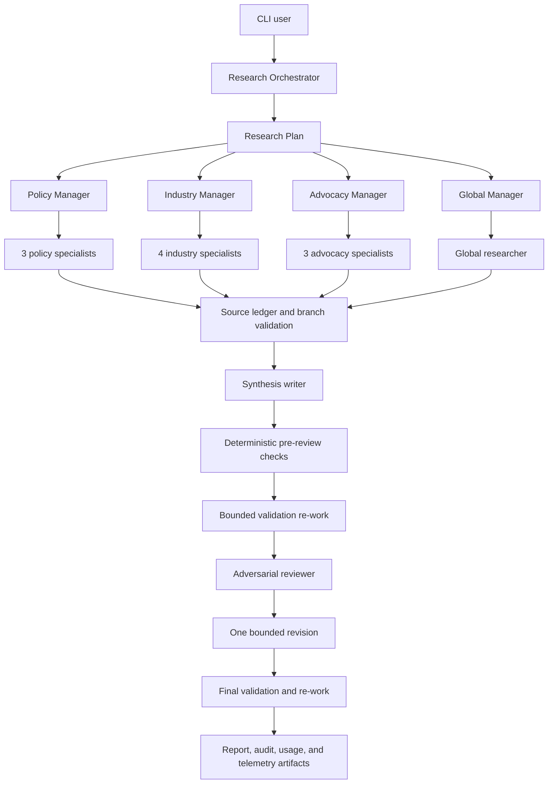

# Housing Policy Research Network

Housing Policy Research Network is a CLI-first demonstration application for producing decision-ready, evidence-grounded housing-policy research. It uses the OpenAI Agents SDK for Python to coordinate a hierarchical research network and Promptfoo for deterministic and rubric-based evaluation.

The default `demo` path is fully offline and fixture-backed. Live research is opt-in and uses the Agents SDK hosted web search tool when an OpenAI API key is configured.

## Quick start

```powershell
python -m venv .venv
.\.venv\Scripts\Activate.ps1
python -m pip install -e ".[dev]"
python -m housing_policy_agents.cli demo --offline --format both
```

The completed run is written to `artifacts/<run_id>/`.

The demo uses synthetic fixture records and is explicitly labeled as such. Do not treat its sources as verified policy evidence.

## Commands

```powershell
housing-research demo --offline --format both
housing-research ask "Should the United States permit alternative credit data in mortgage underwriting?" --fast
housing-research graph --format mermaid
housing-research validate artifacts/<run_id>/package.json
pytest -q
ruff check .
mypy src tests evals
npm ci
npm run eval:offline
```

Live mode requires `OPENAI_API_KEY`, `OPENAI_MODEL`, and `RESEARCH_PROVIDER=web`. It is intentionally excluded from the default offline evaluation suite.

During `ask` and `demo --live`, the CLI prints bounded progress for intake, planning, each research branch, manager reconciliation, drafting, adversarial review, revision, validation re-work, usage, and artifact persistence. Each specialist assignment includes its role definition, shared research context, sibling branches, in-scope and out-of-scope boundaries, preferred source classes, downstream handoff requirements, and typed response contract. Live agent outputs remain Pydantic-validated; models containing typed mappings use the Agents SDK's explicit non-strict schema fallback because that SDK path cannot represent arbitrary JSON object keys in strict mode.

## Environment configuration

Copy `.env.example` to `.env` for a local configuration. Offline mode requires no key. Live mode requires an OpenAI API key, `RESEARCH_PROVIDER=web`, and `ALLOW_NETWORK=true`; the application refuses live configuration without the explicit network switch. Set bounded limits such as `MAX_TURNS_PER_AGENT`, `REVISION_TIMEOUT_SECONDS`, `MAX_REWORK_PASSES`, `REWORK_TIMEOUT_SECONDS`, `MAX_SOURCES`, `MAX_BRANCH_RETRIES`, and `MAX_CONCURRENCY` for the deployment rather than relying on unbounded model behavior. If a live revision exceeds its timeout, the validated draft is retained and the run completes with an explicit caveat.

Each run writes `audit_report.md` and `audit_report.json`. When deterministic validation flags a paragraph, executive summary, decision matrix, or other report component, the application creates a withheld representation and sends only the flagged targets to a bounded validation re-work specialist. The application merges only authorized target changes, validates again, and records the original content, withholding marker, final replacement, citation changes, repair attempts, and disposition. Unsupported content remains visibly withheld after the configured repair limit.

Each run also writes `usage_report.md` and `usage_report.json`, with request, input, cached-input, cache-write, output, reasoning, total-token, and elapsed-time records for every SDK agent call. Offline deterministic roles appear with zero tokens and their local processing time. Live runs use a versioned [model pricing catalog](docs/model-pricing.md) to calculate an estimated token cost from SDK usage. The report labels the result as an estimate, identifies the applied model and rates, and states excluded charges. `OPENAI_INPUT_COST_PER_MILLION_USD`, `OPENAI_CACHED_INPUT_COST_PER_MILLION_USD`, `OPENAI_CACHE_WRITE_COST_PER_MILLION_USD`, and `OPENAI_OUTPUT_COST_PER_MILLION_USD` remain available as optional overrides.

By default, live runs also persist redacted sub-agent telemetry. The artifact root contains `interaction_summary.json`; `sub-agent-telemetry/index.json` lists workflow handoffs and recorded calls; and each numbered interaction directory contains `request.json`, `transcript.json`, and `result.json`. Specialist failures include the exception, bounded traceback, request payload, and any partial SDK items available from the failed run. Set `SUB_AGENT_TELEMETRY_INCLUDE_CONTENT=false` to keep metadata, handoffs, and failure details while omitting prompt/response bodies, or set `SUB_AGENT_TELEMETRY_ENABLED=false` to disable the files entirely. Content is truncated per value at `SUB_AGENT_TELEMETRY_MAX_CHARS` and common secret-shaped values are redacted.

The specialist contract uses short internal source IDs and stores URLs separately in `SourceRecord.url`. If a live model incorrectly places a URL in `source_id`, the model boundary deterministically converts it to a stable internal ID, preserves the URL, and rewrites claim references before strict validation. This protects the run from a common model-formatting failure while retaining the original evidence locator.

## Fixed and interactive requests

`ask` is interactive by default and asks only high-value clarification questions. Use `--fast` to accept transparent defaults:

```powershell
housing-research ask "Should the United States permit alternative credit data in mortgage underwriting?" --fast --format both
housing-research ask "How should a city reform zoning and land use to increase housing supply?" --format markdown
```

Use `demo --offline` for the fixed mortgage-portability example. Markdown citations link to the run-local `sources.md` ledger; JSON contains the typed package and every intermediate boundary.

## Agents-as-tools decision

Managers and specialists are exposed as bounded `Agent.as_tool` calls so the hierarchy is visible and composable. Handoffs were not chosen for the core path because the application, not a model, must own branch selection, concurrency, retry limits, failed-branch disclosure, validation, and the single-revision policy. The explicit Python workflow still uses Agents SDK `Runner` calls for live specialist, writer, and reviewer execution.

## Evaluation and traces

Run the deterministic suite with `npm ci; npm run eval:offline`. Compare the complete hierarchy with the shallow baseline, then run `npm run eval:ablation` to disable legal, global, advocacy, manager reconciliation, or adversarial review. Results and Promptfoo output are local evaluation artifacts; inspect individual metrics rather than relying on one aggregate score. Live evaluation is opt-in:

```powershell
$env:OPENAI_API_KEY = "..."
$env:ALLOW_NETWORK = "true"
$env:RESEARCH_PROVIDER = "web"
npm run eval:live
```

Live runs configure Agents SDK tracing metadata and write application event/metric records. View hosted traces through the OpenAI tracing dashboard associated with the configured project; never enable sensitive trace data unless the deployment's privacy review permits it.

## Architecture



Managers are bounded agent tools and specialists return typed findings. Python owns the workflow state machine, branch selection, retry policy, concurrency, validation, persistence, and revision count.

## Safety and limitations

This system provides research assistance, not legal advice. Sources must be verified before formal reliance. Forecasts, causal claims, and policy conclusions are uncertain. Retrieved content is untrusted data; embedded instructions are detected and ignored. Synthetic fixtures are clearly labeled and must not be treated as live evidence.

See `docs/architecture.md`, `docs/agent-contracts.md`, `docs/threat-model.md`, `docs/evaluation-design.md`, and `docs/limitations.md`.

The worked fixture walkthrough is in `examples/mortgage_portability_run.md`.
