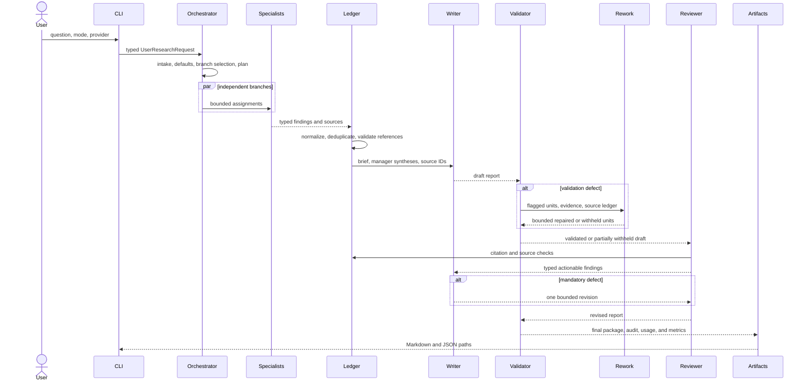

# Architecture

Housing Policy Research Network is a CLI-first, application-controlled research workflow. Python owns state, concurrency, retries, validation, artifact persistence, tracing metadata, sub-agent interaction telemetry, and the bounded revision count. The OpenAI Agents SDK supplies typed agents, hosted web search for live mode, tracing configuration, and manager/specialist callable tools.

Each live agent call is wrapped by the application telemetry recorder. It captures the bounded request payload, SDK-generated run items (including tool calls and outputs), raw model responses, final output, failure details, usage details, and explicit workflow handoffs. An SDK lifecycle hook records model responses before typed parsing so token usage remains available when structured output fails. Artifacts expose a root `interaction_summary.json` plus a `sub-agent-telemetry/` directory with an index and one folder per interaction. Content capture is redacted, bounded, and configurable through `SUB_AGENT_TELEMETRY_*` settings.

## Runtime flow

## Agent topology

The orchestrator exposes four manager agents as bounded `Agent.as_tool` tools. Each manager exposes its specialists as bounded callable tools. In the explicit offline workflow, Python executes independent specialist assignments concurrently and invokes deterministic manager synthesis; in live mode the same typed contracts are passed through Agents SDK `Runner` calls. Handoffs are not used because the user-facing controller must retain ownership of budgets, branch status, errors, and revision policy.

Every runtime `ResearchAssignment` is a structured handoff, not just a one-line objective. It carries the shared question and policy context, manager and sibling-branch purpose, role-specific in-scope and out-of-scope boundaries, preferred source classes, research dimensions, required questions, and a response contract. Manager, writer, reviewer, and revision payloads carry corresponding upstream/downstream handoff context. Specialist prompts additionally define role temperament, evidence rules, source-ID conventions, and a pre-return validation checklist.

The internal source-ID contract is strict and stable: short IDs such as `s1` or `s_fhfa_chattel` are used for references, while full URLs live in `SourceRecord.url`. The model boundary normalizes URL-shaped IDs into deterministic IDs and rewrites nested references before strict Pydantic validation, so a semantically useful response is not discarded solely because a model confused an identifier with a locator.

The configured graph is emitted by `housing-research graph --format mermaid` and is also represented in `src/housing_policy_agents/agents/factory.py`.

## Data and safety boundaries

`SourceLedger` is the only source registry used for citations. Retrieved excerpts are data, never instructions. Source prompt-injection flags are retained for auditability but are not passed into claim support. `validate_claim_references` and `validate_report` run before and after review. Report validation issues carry target IDs. The re-work specialist may change only those targets; unsupported targets remain visibly withheld and every disposition is recorded in `audit_report.md`. Live web search is opt-in (`RESEARCH_PROVIDER=web`, `ALLOW_NETWORK=true`, and `OPENAI_API_KEY`); offline mode uses synthetic fixture records and never presents them as verified evidence.

## Configuration and observability

`AppConfig` bounds turns, sources, searches, retries, re-work passes, concurrency, tokens, time, source diversity, and primary-source coverage. It also contains ablation switches for clarification, manager reconciliation, adversarial review, and named branches. Each run persists the plan, branch findings, ledger, draft, review, final report, audit report, usage report, metrics, and event log under `artifacts/<run_id>/`.
